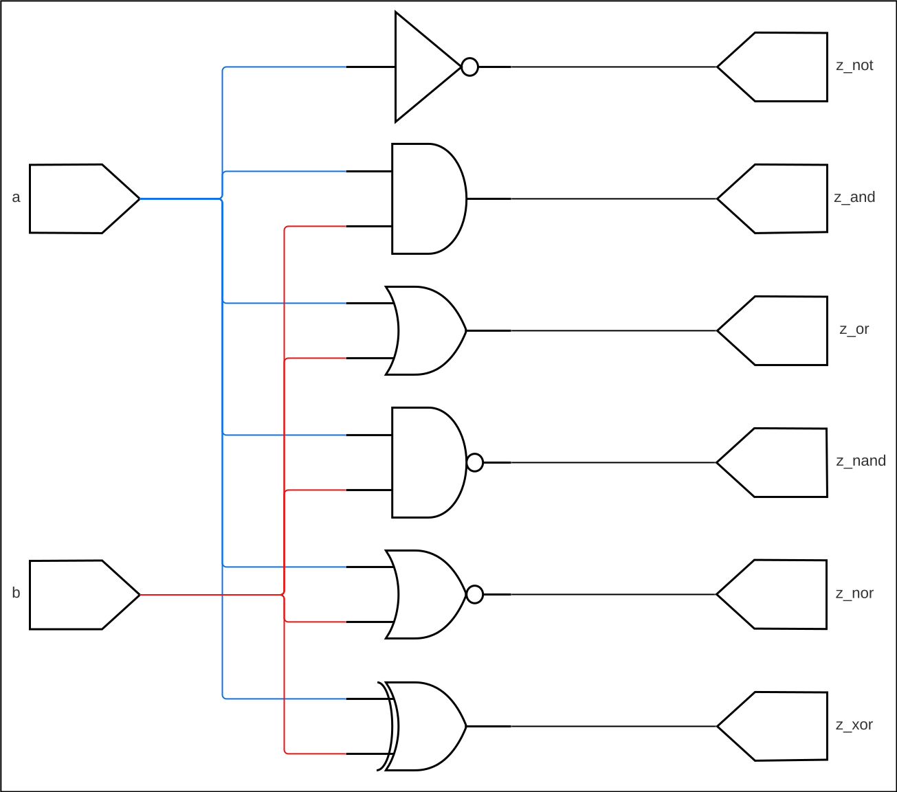

# UTCN CA LABS ADDITIONAL SUPPLEMENT

---

## Basic Logic Gates



```vhdl
library ieee;
  use ieee.std_logic_1164.all;
  use ieee.std_logic_arith.all;
  use ieee.std_logic_unsigned.all;

entity basic_gates is
  port (
    a      : in    std_logic;
    b      : in    std_logic;
    z_not  : out   std_logic;
    z_and  : out   std_logic;
    z_or   : out   std_logic;
    z_nand : out   std_logic;
    z_nor  : out   std_logic;
    z_xor  : out   std_logic
  );
end entity basic_gates;

architecture rtl of basic_gates is

begin

  z_not  <= not a;
  z_and  <= a and b;
  z_or   <= a or b;
  z_nand <= a nand b;
  z_nor  <= a nor b;
  z_xor  <= a xor b;

end architecture rtl;
```


## Latches

### Simple Latch with Pos Gate

```vhdl
library ieee;
  use ieee.std_logic_1164.all;
  use ieee.std_logic_arith.all;
  use ieee.std_logic_unsigned.all;

entity basic_latch is
  port (
    d  : in    std_logic;
    en : in    std_logic; -- positive gate
    q  : out   std_logic
  );
end entity basic_latch;

architecture rtl of basic_latch is

begin

  d_latch_proc : process (en) is
  begin

    if (en = '1') then
      q <= d;
    end if;

  end process d_latch_proc;

end architecture rtl;
```

### Latch with Async Set / Reset

```vhdl
library ieee;
  use ieee.std_logic_1164.all;
  use ieee.std_logic_arith.all;
  use ieee.std_logic_unsigned.all;

entity latch_async_set_reset is
  port (
    en    : in    std_logic; -- positive gate
    set   : in    std_logic;
    reset : in    std_logic;
    val   : in    std_logic_vector(3 downto 0);
    d     : in    std_logic_vector(3 downto 0);
    q     : out   std_logic_vector(3 downto 0)
  );
end entity latch_async_set_reset;

architecture rtl of latch_async_set_reset is

begin

  latch_async_set_reset_proc : process (en) is
  begin

    if (reset='1') then
      q <= x"0";
    elsif (set='1') then
      q <= val;
    elsif (en = '1') then
      q <= d;
    end if;

  end process latch_async_set_reset_proc;

end architecture rtl;
```

## Flip-Flops

### Basic D FF

```vhdl
library ieee;
  use ieee.std_logic_1164.all;
  use ieee.std_logic_arith.all;
  use ieee.std_logic_unsigned.all;

entity d_ff_basic is
  port (
    clk : in    std_logic;
    d   : in    std_logic;
    q   : out   std_logic
  );
end entity d_ff_basic;

architecture rtl of d_ff_basic is

begin

  basic_d_ff : process (clk) is
  begin

    if rising_edge(clk) then
      q <= d;
    end if;

  end process basic_d_ff;

end architecture rtl;
```

### D FF with Clock Enable

```vhdl
library ieee;
  use ieee.std_logic_1164.all;
  use ieee.std_logic_arith.all;
  use ieee.std_logic_unsigned.all;

entity d_ff_ce is
  port (
    clk : in    std_logic;
    ce  : in    std_logic;
    d   : in    std_logic;
    q   : out   std_logic
  );
end entity d_ff_ce;

architecture rtl of d_ff_ce is

begin

  d_ff_ce_proc : process (clk) is
  begin

    if rising_edge(clk) then
      if (ce = '1') then
        q <= d;
      end if;
    end if;

  end process d_ff_ce_proc;

end architecture rtl;
```

### D FF with CE and Sync Reset

```vhdl
library ieee;
  use ieee.std_logic_1164.all;
  use ieee.std_logic_arith.all;
  use ieee.std_logic_unsigned.all;

entity d_ff_ce_reset is
  port (
    clk   : in    std_logic;
    ce    : in    std_logic;
    reset : in    std_logic;
    d     : in    std_logic;
    q     : out   std_logic
  );
end entity d_ff_ce_reset;

architecture rtl of d_ff_ce_reset is

begin

  d_ff_ce_reset_proc : process (clk) is
  begin

    if rising_edge(clk) then
      if (reset = '1') then
        q <= '0';
      elsif (ce = '1') then
        q <= d;
      end if;
    end if;

  end process d_ff_ce_reset_proc;

end architecture rtl;
```

### D FF with CE and Sync Set / Reset

```vhdl
library ieee;
  use ieee.std_logic_1164.all;
  use ieee.std_logic_arith.all;
  use ieee.std_logic_unsigned.all;

entity d_ff_ce_reset_set is
  port (
    clk   : in    std_logic;
    ce    : in    std_logic;
    reset : in    std_logic;
    set   : in    std_logic;
    d     : in    std_logic_vector(3 downto 0);
    val   : in    std_logic_vector(3 downto 0);
    q     : out   std_logic_vector(3 downto 0)
  );
end entity d_ff_ce_reset_set;

architecture rtl of d_ff_ce_reset_set is

begin

  d_ff_ce_reset_set_proc : process (clk) is
  begin

    if rising_edge(clk) then
      if (reset = '1') then
        q <= x"0";
      elsif (set = '1') then
        q <= val;
      elsif (ce = '1') then
        q <= d;
      end if;
    end if;

  end process d_ff_ce_reset_set_proc;

end architecture rtl;
```

### D FF with CE & Async Set Reset

```vhdl
library ieee;
  use ieee.std_logic_1164.all;
  use ieee.std_logic_arith.all;
  use ieee.std_logic_unsigned.all;

entity d_ff_ce_async_reset_set is
  port (
    clk   : in    std_logic;
    ce    : in    std_logic;
    reset : in    std_logic;
    set   : in    std_logic;
    d     : in    std_logic_vector(3 downto 0);
    val   : in    std_logic_vector(3 downto 0);
    q     : out   std_logic_vector(3 downto 0)
  );
end entity d_ff_ce_async_reset_set;

architecture rtl of d_ff_ce_async_reset_set is

begin

  basic_d_ff : process (clk, reset, set) is
  begin

    if (reset = '1') then
      q <= x"0";
    elsif (set = '1') then
      q <= val;
    elsif rising_edge(clk) then
      if (ce = '1') then
        q <= d;
      end if;
    end if;

  end process basic_d_ff;

end architecture rtl;
```

## MUX

### 4 to 1

```vhdl
library ieee;
  use ieee.std_logic_1164.all;

entity four_to_one_mux is
  port (
    a : in    std_logic;
    b : in    std_logic;
    c : in    std_logic;
    d : in    std_logic;
    s : in    std_logic_vector(1 downto 0);
    o : out   std_logic
  );
end entity four_to_one_mux;

architecture rtl of four_to_one_mux is

begin

  four_to_one_mux_proc : process (a, b, c, d, s) is
  begin

    case s is
      when   "00" => o <= a;
      when   "01" => o <= b;
      when   "10" => o <= c;
      when   "11" => o <= d;
      when others => o <= a;
    end case;

  end process four_to_one_mux_proc;

end architecture;
```

### 2 to 1

```vhdl
library ieee;
  use ieee.std_logic_1164.all;
  use ieee.std_logic_arith.all;
  use ieee.std_logic_unsigned.all;

entity two_to_one_mux is
  port (
    a : in    std_logic;
    b : in    std_logic;
    s : in    std_logic;
    o : out   std_logic
  );
end entity two_to_one_mux;

architecture rtl of two_to_one_mux is

begin

  two_to_one_mux_proc : process (a, b, s) is
  begin

    if (s = '1') then
      o <= a;
    else
      o <= b;
    end if;

  end process two_to_one_mux_proc;

end architecture;
```

### 2 to 1 (VHDL-2008)

```vhdl
-- REQUIRES VHDL-2008 to be enabled

library ieee;
  use ieee.std_logic_1164.all;
  use ieee.std_logic_arith.all;
  use ieee.std_logic_unsigned.all;

entity two_to_one_mux_with is
  port (
    a : in    std_logic;
    b : in    std_logic;
    s : in    std_logic;
    o : out   std_logic
  );
end entity two_to_one_mux_with;

architecture rtl of two_to_one_mux_with is

begin

  two_to_one_mux_with_proc : process (a, b, s) is
  begin

    with s select o <=
      a when '1',
      b when others;

  end process two_to_one_mux_with_proc;

end architecture rtl;
```

## Decoders

### 3 to 8 Decoder

```vhdl
library ieee;
  use ieee.std_logic_1164.all;

entity three_to_eight_dcd is
  port (
    s   : in    std_logic_vector(2 downto 0);
    res : out   std_logic_vector(7 downto 0)
  );
end entity three_to_eight_dcd;

architecture rtl of three_to_eight_dcd is

begin

  three_to_eight_dcd_proc : process (s) is
  begin

    case s is
      when "001"  => res <= b"0000_0001";
      when "010"  => res <= b"0000_0010";
      when "011"  => res <= b"0000_0100";
      when "100"  => res <= b"0000_1000";
      when "101"  => res <= b"0001_0000";
      when "110"  => res <= b"0010_0000";
      when "111"  => res <= b"0100_0000";
      when others => res <= b"0000_0000";
    end case;

  end process three_to_eight_dcd_proc;

end architecture;
```

## Arithmetic Operations

### Adder (without Carry)

```vhdl
library ieee;
  use ieee.std_logic_1164.all;
  use ieee.std_logic_arith.all;
  use ieee.std_logic_unsigned.all;

entity add is
  port (
    a   : in    std_logic_vector(3 downto 0);
    b   : in    std_logic_vector(3 downto 0);
    sum : out   std_logic_vector(3 downto 0)
  );
end entity add;

architecture rtl of add is

begin

  sum <= a + b;

end architecture rtl;
```

### Subtractor

```vhdl
library ieee;
  use ieee.std_logic_1164.all;
  use ieee.std_logic_arith.all;
  use ieee.std_logic_unsigned.all;

entity sub is
  port (
    a    : in    std_logic_vector(3 downto 0);
    b    : in    std_logic_vector(3 downto 0);
    diff : out   std_logic_vector(3 downto 0)
  );
end entity sub;

architecture rtl of sub is

begin

  diff <= a - b;

end architecture rtl;
```

### Shifters

#### Shift left by 1-bit

```vhdl
library ieee;
  use ieee.std_logic_1164.all;
  use ieee.std_logic_arith.all;
  use ieee.std_logic_unsigned.all;

entity sl is
  port (
    clk : in    std_logic;
    di  : in    std_logic_vector(3 downto 0);
    do  : out   std_logic_vector(3 downto 0)
  );
end entity sl;

architecture rtl of sl is

begin

  process (clk) is
  begin

    if rising_edge(clk) then
      do <= di(2 downto 0) & '0';
    end if;

  end process;

end architecture rtl;
```

#### Shift right by 1-bit

```vhdl
library ieee;
  use ieee.std_logic_1164.all;
  use ieee.std_logic_arith.all;
  use ieee.std_logic_unsigned.all;

entity sl is
  port (
    clk : in    std_logic;
    di  : in    std_logic_vector(3 downto 0);
    do  : out   std_logic_vector(3 downto 0)
  );
end entity sl;

architecture rtl of sl is

begin

  process (clk) is
  begin

    if rising_edge(clk) then
      do <= '0' & di(3 downto 1);
    end if;

  end process;

end architecture rtl;
```